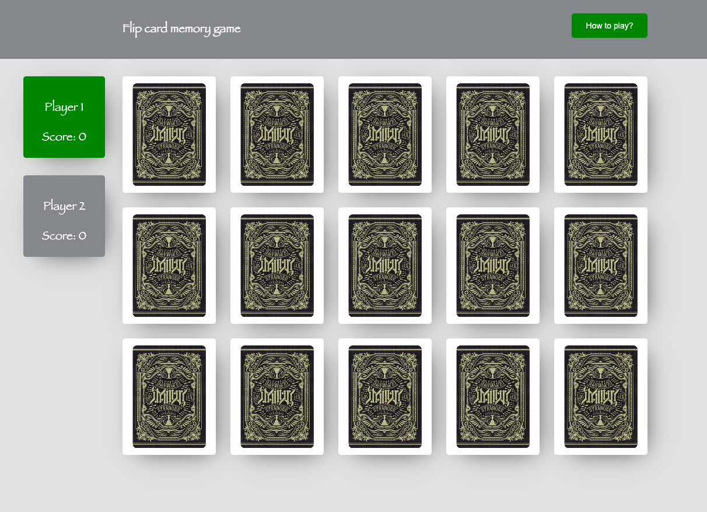

# flip-card-memory-game

This project was generated with [Angular CLI](https://github.com/angular/angular-cli) version 11.0.3.

## Setup

- Download the repo on local machine
- run command `npm i`
- run command `npm start`
- launch `http://localhost:4200/` in the browser

## Build

Run `ng build` to build the project. The build artifacts will be stored in the `dist/` directory. Use the `--prod` flag for a production build.

## Running unit tests

Run `ng test` to execute the unit tests via [Karma](https://karma-runner.github.io).

## How to play the game

A number of cards are placed face down in a grid in a random order. The cards have images
on their face and the cards are in pairs, with each pair having the same image.
Each turn the player turns over two cards. If they are a matching pair they remain face up. If
they don’t match they are turned face down again.
The game finishes when all the pairs have been removed.
See: https://en.wikipedia.org/wiki/Concentration_(card_game)

## Game Page design

## Unit test suite

## Code coverage

